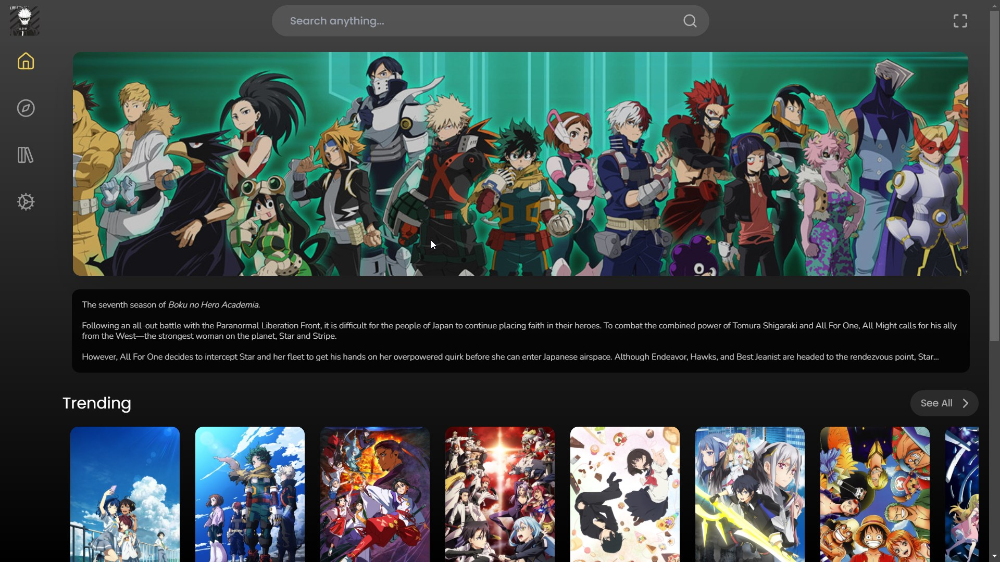
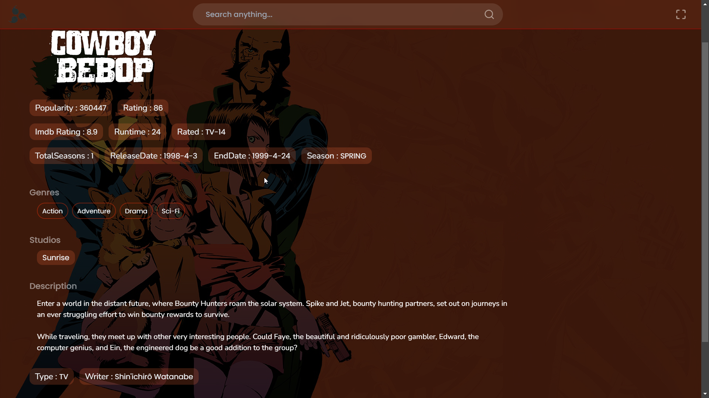
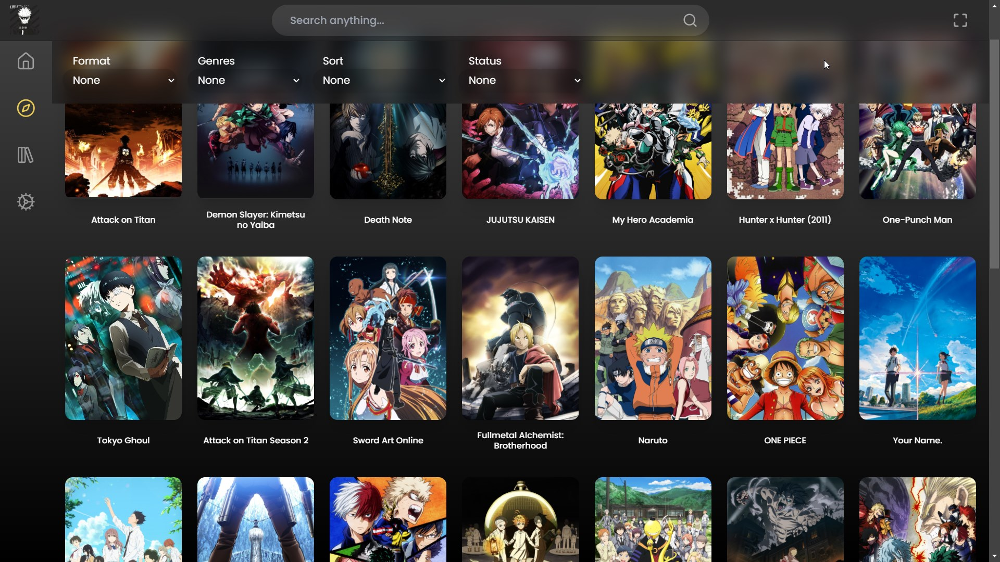

<p align="center">
    
    <h1 align="center">Otaku-io</h1>
</p>

<br/>
    
    
    

<br/>

Otaku-io is an anime streaming platform built with Next.js, offering a seamless anime-watching experience directly in your browser.

## Features

- **Anime Streaming**: Watch your favorite anime with smooth playback.
- **Responsive Design**: Optimized for both desktop and mobile devices.
- **Dynamic Scraping**: Utilizes the `Consumet.ts` library for fetching the latest anime content.
- **Progressive Web App (PWA)**: Install Otaku-io as a PWA for a native-like experience on your device.
- **User Authentication**: Secure login and authentication using NextAuth.
- **Custom Video Player**: Integrated with `@arghya-lab/react-video` for a customizable video experience.
- **Infinite Scroll**: Easily browse through anime lists with infinite scrolling.

## Getting Started

To get started with Otaku-io, follow these steps:

1. **Clone the repository**:
   ```bash
   git clone https://github.com/Arghya-lab/otaku-io.git
   cd otaku-io
   ```
2. **Install dependencies**:

```bash
npm install
```

3. **Run the development server**:

```bash
npm run dev
```

4. **Open the app**: Open your browser and navigate to http://localhost:3000 to see Otaku-io in action.

## Deployment

Otaku-io is deployed on Vercel. You can visit the live app at https://otaku-io.vercel.app.

## Fork the repository.

1. Create a new branch: `git checkout -b feature/YourFeature`.\
2. Commit your changes: `git commit -m 'Add some feature'`.\
3. Push to the branch: `git push origin feature/YourFeature`.\
4. Open a pull request.

## License

This project is licensed under the MIT License - see the LICENSE file for details.

## Acknowledgements

Thanks to the team behind _Consumet.ts_ for their amazing work on scraping anime data.
A special thanks to all the contributors who have helped build `Consumet.ts`

Feel free to visit the live app at https://otaku-io.vercel.app and enjoy your favorite anime!
